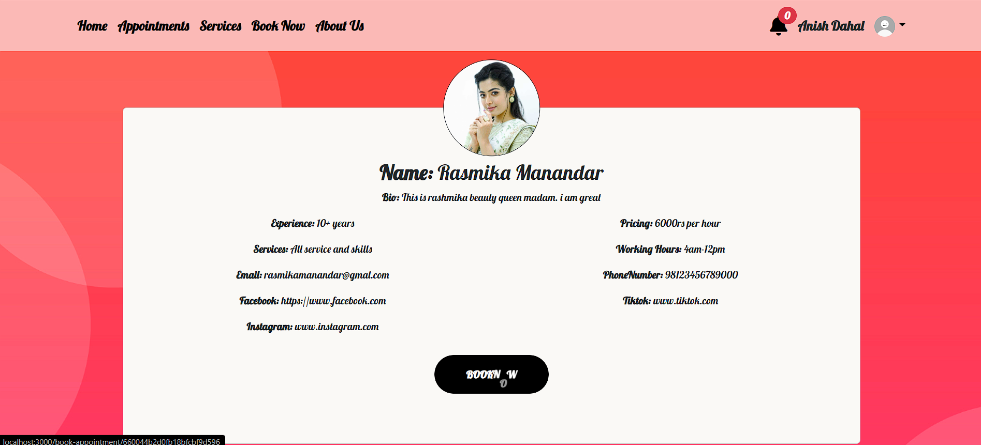
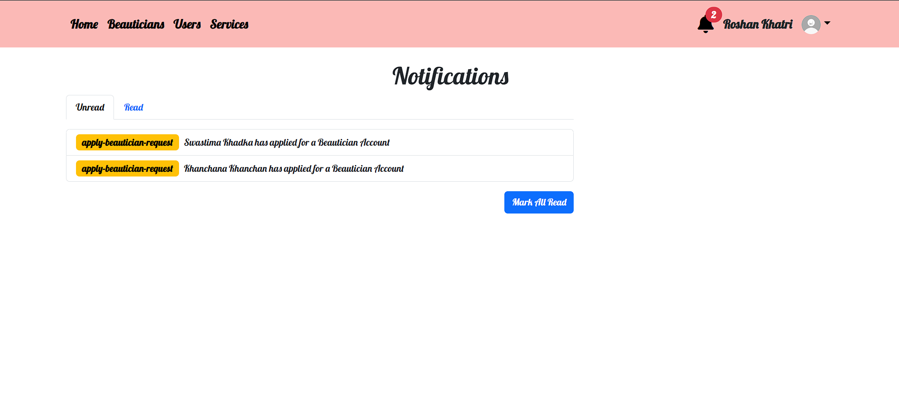
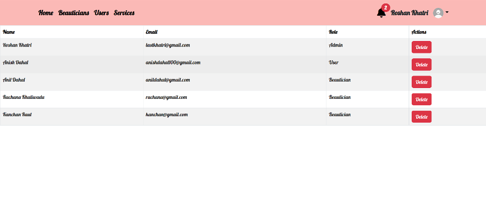

# Beautify -- Beautician Booking App

Beautify is a Beautician booking app made with the MERN stack. It has separate areas for admins, beauticians, and users, all with secure login. The app makes booking easy with notifications and a smooth process. Its design works well on any device and looks great with animations.

## Backend Code:

https://github.com/RoshanKhatri0/Beautician-express


## Run Locally

Clone the project

```bash
  git clone https://github.com/RoshanKhatri0/beautician-frontend
```

Go to the project directory

```bash
  cd beautician-frontend
```

Install dependencies

```bash
  npm install
```

Start the server

```bash
  npm start
```


## Screenshots







